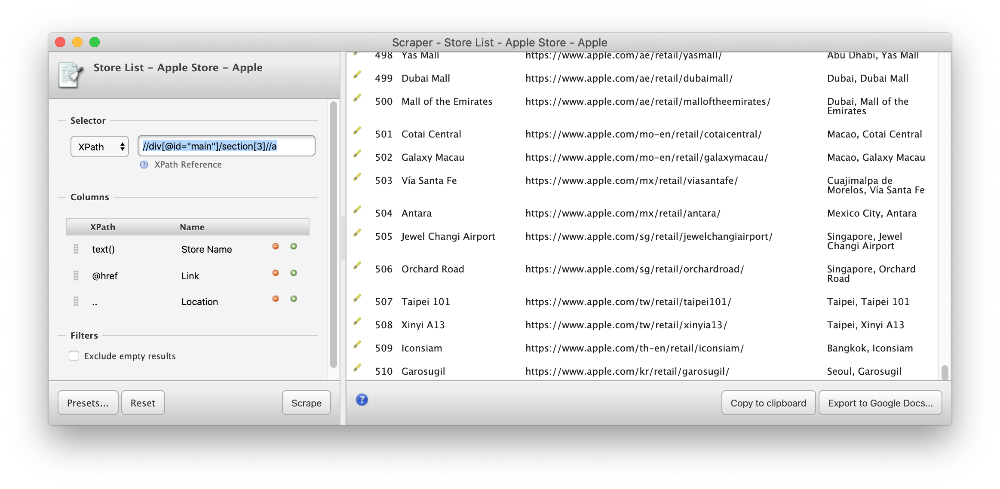
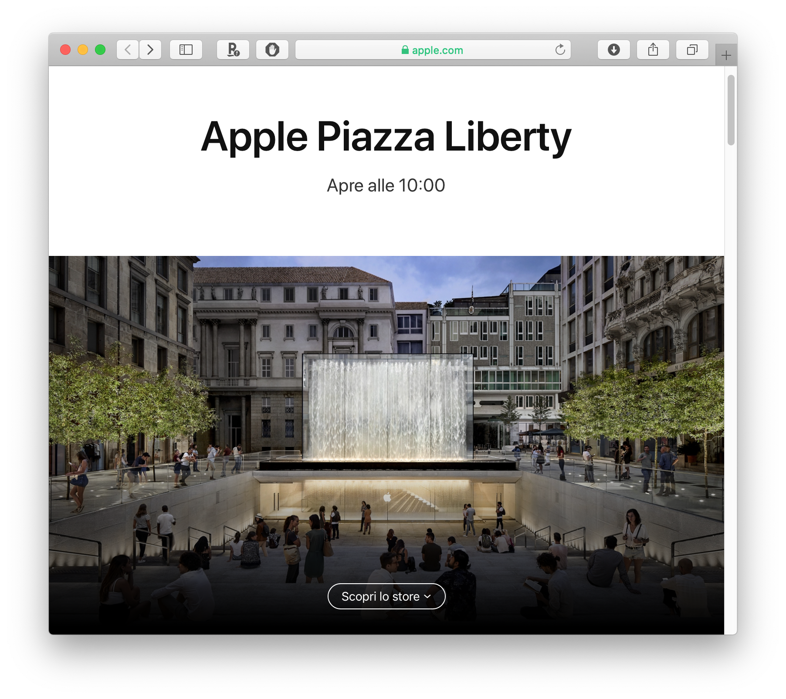
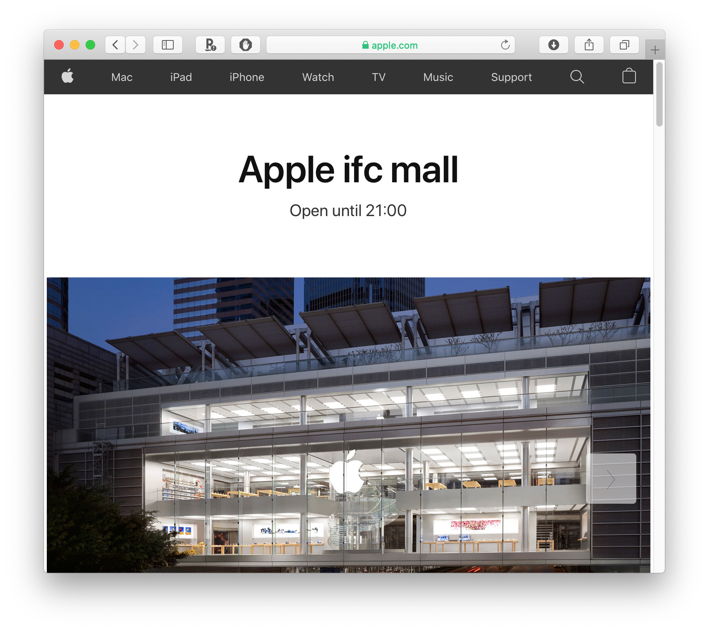
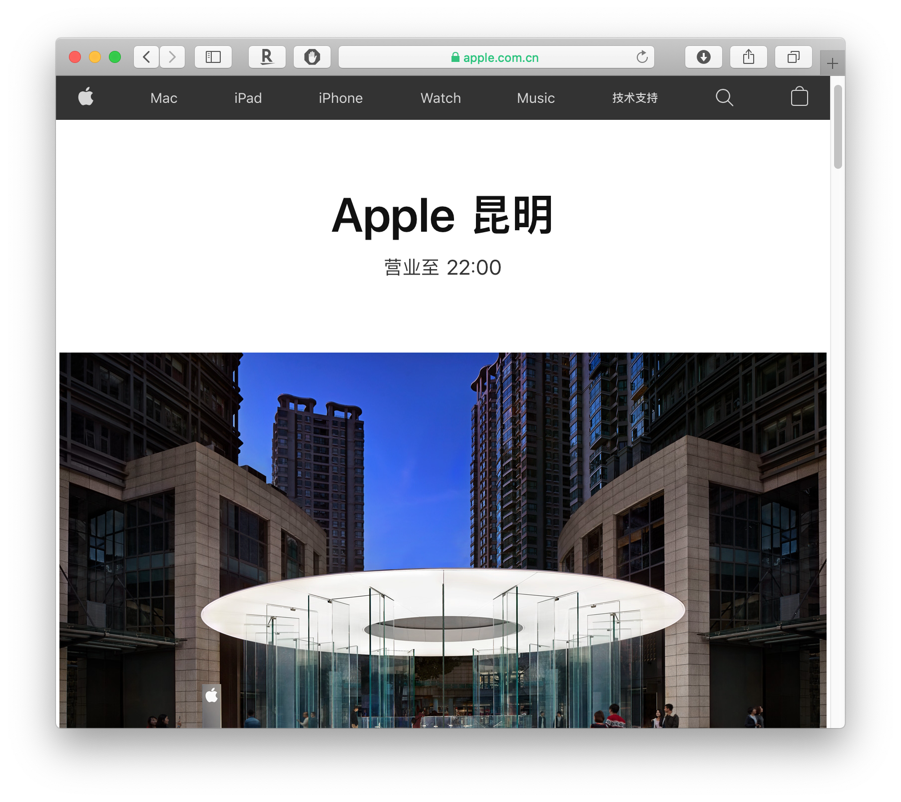

# Apple Store Gallery

Have you ever wonder what Apple Stores look like in other countries? Are you looking for a website that showcase all the Apple Stores in the world? Here you go! A web scraping project to collect the official pictures of Apple Stores all around the world from [apple.com](apple.com).

## Getting Around

**To appreciate the some of the beautiful Apple Stores, go to [output/gallery](output/gallery).**

All the source code is located in [src](src).

You can get a list of Apple Store in [here](./output/apple_store_list.csv). The list of all store images are located [here](./output/all_images.csv)

## Scraping Process

### Getting a list of Apple Stores

Apple lists its worldwide retail stores [here](https://www.apple.com/retail/storelist/). Use the following XPath can pull a tag for each Apple Store around the world (many of them are hidden). 

```xquery
//div[@id="main"]/section[3]//a
```

I recommend Chrome extension [Scraper](https://chrome.google.com/webstore/detail/scraper/mbigbapnjcgaffohmbkdlecaccepngjd) for pulling tabular information in a website.



A list of stores with links is also stored in [here](./output/apple_store_list.csv) as a CSV.

### Understanding Apple Store Website Structure

There are different kinds of Apple Stores, and so are their websites. Here are the 3 categories of Apple Store websites. 

#### ⭐️⭐️⭐️ Stores

The most grandiose of them all are stores like [Apple Piazza Liberty](https://www.apple.com/it/retail/piazzaliberty/) in Milan, Italy or [Apple Fifth Avenue](https://www.apple.com/retail/fifthavenue/) in New York, USA. You can "explore" those stores through their websites. These websites have multiple containers to display many images of their stores.



We can search its main photo using the following XPath (see [Updating XPath](#Updating-XPath) for a small caveat):

```xquery
//div[@id="main"]/section[2]//figure/@class
```

And all the additional photos using

```xquery
//div[@id="main"]/div[2]//figure/@class
```

#### ⭐️⭐️ Stores

Less grandiose stores only have a single container displaying multiple images, e.g. [Apple ifc mall](https://www.apple.com/hk/en/retail/ifcmall/). 



To find all the relevant figure tags, use  

```xquery
//div[@id="main"]/section[2]//figure
```

#### ⭐️ Stores

Most store websites only have a single image showing off their store fronts. These stores can still look as good as ⭐️⭐️ Stores, or even the ⭐️⭐️⭐️ ones, e.g. [Apple 昆明](https://www.apple.com.cn/cn/retail/kunming/).



To get the location of the image, use the same XPath as the ⭐️⭐️ Stores.

```xquery
//div[@id="main"]/section[2]//figure
```

### Getting the Images

With that in mind, we can pull all the relevant image names in the html we request. Let's use [Apple Grand Central]('https://www.apple.com/retail/grandcentral/') as an example. Using the XPath in [⭐️⭐️ Stores](#⭐️⭐️-Stores), we get the following image names:

```python
['image-hero', 'image-retail-store-galleries-grandcentral-grandcentral-gallery-image2', 'image-retail-store-galleries-grandcentral-grandcentral-gallery-image3', 'image-retail-store-galleries-grandcentral-grandcentral-gallery-image4', 'image-retail-store-galleries-grandcentral-grandcentral-gallery-image5', 'image-retail-store-galleries-grandcentral-grandcentral-gallery-image6', 'image-store-360-overlay', 'loading']
```

However, there are two issues:

1. **The last two image names are in fact not useful to us.** They are here because [Apple Grand Central]('https://www.apple.com/retail/grandcentral/') provides a 360-degree viewer. This issue was not  occuring when I performed XPath search using a browser. To solve this issue, see [Updating XPath](#Updating-XPath).
2. More importantly, the **actual link to the image file is not embedded** in corresponding html element. The solution is discuss in [Finding the Links](#Finding-the-Links)

#### Updating XPath

Since we want our XPath query to locate only those images that we care about, we will use the following the locate the image names in the main container (yes, they look ugly, but they can get precisely what I want):

```xquery
//section[contains(@class,"section-store-summary") or contains(@class, "section-hero")]//figure[not(contains(@class, "360") or contains(@class,"loading"))]/@class
```

Similar issues also occur occassionally for the XPath used to find additional images in a [⭐️⭐️⭐️ Stores](#⭐️⭐️⭐️-Stores). 

```xquery
//div[contains(@class,"section-drawer")]//figure[not(contains(@class, "reptiles") or @class="image")]/@class
```

we can get all the image names.

#### Finding the Links

Since the link to each images are not directly embedded in the website's html but its stylesheet, we need to do some additional searching. Specifically, the image links are located in css stylesheets located in one of these area:

1. Style embedded in the html. To find the style, we can use

   ```xquery
   //style[contains(.,image_name)]/text()
   ```

   to find the style contains the specific image name.

2. Style located in other stylesheet that is named `store.built.css` or `store.css`. To locate them, we can do a XPath search on the main html:

   ```xquery
   //link[contains(@href,"store.built.css")]/@href
   ```

Let's use [Apple Fifth Avenue](https://www.apple.com/retail/fifthavenue/) as example. We can find these image names:

```python
['image-hero', 'store-drawer-gallery-1-item-1', 'store-drawer-gallery-1-item-2', 'store-drawer-gallery-2-item-1', 'store-drawer-gallery-2-item-2', 'store-drawer-gallery-3-item-1', 'store-drawer-gallery-3-item-2']
```

The `image-hero` is located in the style embedded in the html:

```css
.image-hero {
	background-image: url("/retail/fifthavenue/images/hero_large.jpg")
}
@media only screen and (-webkit-min-device-pixel-ratio: 1.5), only screen and (min-resolution: 1.5dppx), (-webkit-min-device-pixel-ratio: 1.5), (min-resolution: 144dpi) {
	.image-hero {
		background-image: url("/retail/fifthavenue/images/hero_large_2x.jpg")
	}
}
...
```

Since I want the larger image, we will get the image with suffix `_large_2x.jpg` whenever it is availble. I was planning to use regular expression the pull the url out but it was actually cleaner to use a css parser instead. I use  [`tinycss2`](https://tinycss2.readthedocs.io/en/latest/) to parse the css rules.

### Producing Output

The list of all store images are located [here](./output/all_images.csv). It looks something like this:

| Region | Store Name   | #    | Link                                                         | Store Link                                |
| ------ | ------------ | ---- | ------------------------------------------------------------ | ----------------------------------------- |
| us     | Union Square | 1    | https://www.apple.com/retail/unionsquare/images/hero_large_2x.jpg | https://www.apple.com/retail/unionsquare/ |
| us     | Union Square | 2    | https://www.apple.com/retail/store/images/galleries/unionsquare/images/02_apple_union_square_023_large_2x.jpg | https://www.apple.com/retail/unionsquare/ |
| us     | Union Square | 3    | https://www.apple.com/retail/store/images/galleries/unionsquare/images/03_apple_union_square_039_large_2x.jpg | https://www.apple.com/retail/unionsquare/ |

We will use this table to format our gallery in [output/gallery](output/gallery).

